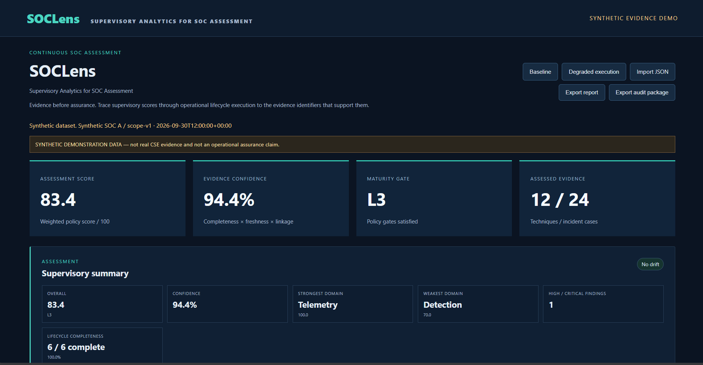
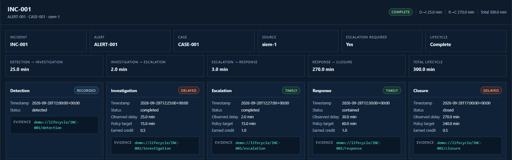
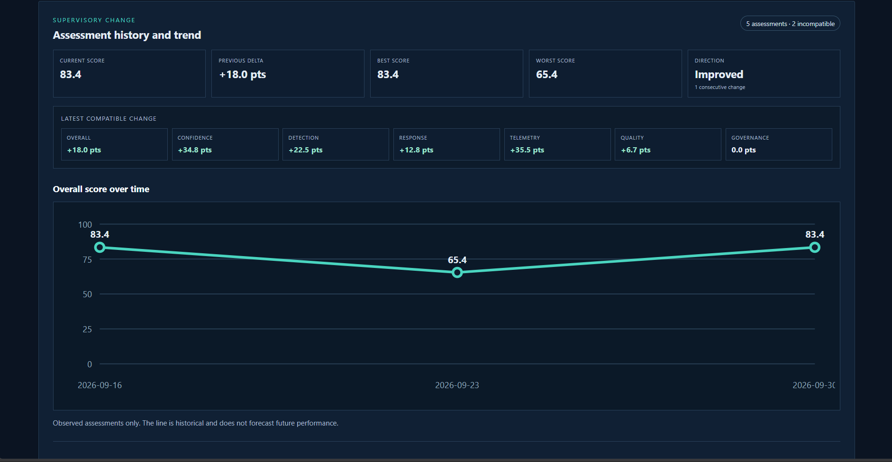

# SOCLens

**Supervisory Analytics for SOC Assessment**

SOCLens is a local, evidence-based supervisory analytics platform designed to assess how effectively a Security Operations Center performs using declared operational evidence rather than relying only on policies, dashboards, or self-assessments. It turns structured SOC records into explainable scores, lifecycle findings, trends, and audit artifacts. SOCLens implements the SAT-SA (Supervisory Analytics Tool for SOC Assessment) concept/problem statement.

## 1. The problem

Organizations may have documented SOC procedures, but supervisors also need evidence that those procedures work in day-to-day operations. SOCLens analyzes operational records to identify:

- missing or delayed actions;
- weak investigation and missing escalation;
- slow response and missing closure;
- telemetry and governance gaps; and
- operational drift over time.

The result is a supervisory assessment that remains tied to the evidence identifiers supplied for review.

## 2. What SOCLens does

```text
SOC Evidence
    ↓
Validation
    ↓
Normalization / Correlation
    ↓
Detection → Investigation → Escalation → Response → Closure
    ↓
Gap Detection
    ↓
Supervisory Scoring
    ↓
Evidence Drill-down
    ↓
History / Trend / Drift
    ↓
Audit Export
```

SOCLens validates submitted JSON, correlates lifecycle records, evaluates operational execution, and persists each assessment locally. Invalid or contradictory evidence is rejected rather than silently repaired.

## 3. Key features

- Evidence-based SOC assessment
- Incident lifecycle correlation
- Detection, investigation, escalation, response, and closure analysis
- Missing-stage and negative-space detection
- Lifecycle timing analysis
- Explainable five-domain scoring
- Evidence confidence scoring
- Maturity assessment and policy gates
- Evidence traceability through opaque references
- Incident-level drill-down
- Local assessment history
- Trend analysis and compatible assessment comparison
- Deterministic drift detection
- Deterministic supervisory summaries
- Reproducible audit ZIP export
- Synthetic baseline and degraded demo scenarios
- Fully local and offline operation
- Deterministic CSV and structured-JSON evidence ingestion
- Versioned, inspectable source-to-canonical mappings

## 4. Assessment domains

The current scoring policy is `sat-sa-demo-2.0`.

| Domain | Weight | What it evaluates |
| --- | ---: | --- |
| Detection | 30% | Risk-weighted validated technique coverage |
| Response | 25% | Eligible containment and lifecycle execution obligations |
| Telemetry | 20% | Weighted source completeness and freshness |
| Quality | 15% | Reviewed-case precision and lifecycle closure discipline |
| Governance | 10% | Applicable controls supported by evidence references |

The overall score is the weighted combination of these five domains:

```text
Overall = 30% Detection + 25% Response + 20% Telemetry
        + 15% Quality + 10% Governance
```

When lifecycle data is available, lifecycle execution influences the Response and Quality domains. The scoring policy and weights are fixed prototype policy, not universal SOC benchmarks.

## 5. Lifecycle analysis

SOCLens correlates stable incident, alert, case, and source identifiers across the operational sequence:

```text
Detection → Investigation → Escalation → Response → Closure
```

The current prototype timing targets are:

| Stage | Target |
| --- | ---: |
| Investigation | 15 minutes |
| Required escalation | 15 minutes |
| Response | 60 minutes |
| Closure | 240 minutes |

Timely stages receive full credit, delayed or present-but-unmeasurable stages receive partial credit, and missing required stages receive no credit. Escalation is evaluated only when it is required.

These values are **prototype supervisory policy thresholds** and require calibration against real operating environments, risk profiles, and service expectations.

## 6. Confidence and maturity

Performance score and confidence measure different things:

- **Performance** represents the evaluated operational outcome.
- **Confidence** represents evidence quality through completeness, freshness, and traceability.

Operational failures reduce performance. Missing, stale, incomplete, or weakly linked evidence affects confidence. Confidence is an evidence-quality index, not a statistical probability.

| Maturity | Score range |
| --- | ---: |
| L1 | Below 40 |
| L2 | 40–59.9 |
| L3 | 60–79.9 |
| L4 | 80 or above |

An assessment becomes **Provisional** when confidence is below 70, fewer than 10 cases have been reviewed, or a required evidence domain is empty. Critical governance gaps cap maturity at L2. L4 also requires Detection of at least 75 and no unvalidated risk-weight-4/5 technique.

## 7. Explainability

```text
Overall Score
    ↓
Domain
    ↓
Lifecycle Component
    ↓
Incident
    ↓
Stage
    ↓
Finding
    ↓
Evidence Reference
```

Supervisors can move from an overall result to domain effects, lifecycle outcomes, individual findings, and the exact evidence identifiers supplied for verification. SOCLens does not retrieve or fabricate the underlying evidence represented by those identifiers.

## 8. History, trend, and drift

SOCLens stores assessment runs locally in SQLite and supports:

- historical assessment retrieval;
- comparison of compatible assessments;
- overall, confidence, and domain deltas;
- an observed overall-score trend;
- deterministic drift detection; and
- detection of lifecycle gaps that recur after previously being absent.

Comparisons require the same policy version, scope identifier, and scope hash. Drift rules evaluate score and domain declines, confidence below the policy floor, new High/Critical findings, and recurring lifecycle gaps.

The trend is historical only. SOCLens does not forecast performance or provide predictive analytics.

## 9. Auditability

Each persisted assessment carries the information required to identify its input, scope, policy, and storage contracts:

| Audit field | Current meaning or value |
| --- | --- |
| Input SHA-256 | Integrity digest of the submitted assessment input |
| Scope SHA-256 | Compatibility digest of the assessed scope |
| Policy version | `sat-sa-demo-2.0` |
| Report schema version | `sat-sa-report-1.0` |
| Database schema version | `2` |
| Manifest version | `sat-sa-manifest-1.0` |
| Audit package version | `sat-sa-audit-1.0` |

The deterministic audit ZIP contains:

- `manifest.json`
- `report.json`
- `findings.json`
- `lifecycle-summary.json`
- `supervisory-summary.json`

The manifest records artifact hashes and sizes. Raw submitted evidence and external evidence files are intentionally excluded from the package.

## 10. Architecture

```text
Browser
   ↓
Local Python HTTP Server
   ↓
Bounded Import Adapters / Versioned Mappings
   ↓
Canonical SOCLens Evidence
   ↓
Assessment Engine
   ↓
Lifecycle / Scoring / Findings
   ↓
Assessment Repository / Explicit Transactions
   ↓
SQLite Assessment History (current backend)
   ↓
Dashboard / Reports / Audit Package
```

The backend uses the Python standard library and SQLite. The frontend uses vanilla JavaScript, HTML, and CSS. Core functionality has no external runtime package, API-key, network-service, or build-tool dependency, and backend scores are not recalculated in the browser.

Phase 6A centralizes SQLite connections and transactions, keeps assessment,
security, and ingestion runtime state in separate persistence boundaries, and
defines the contract a future PostgreSQL backend must satisfy. PostgreSQL is not
implemented. See [Persistence architecture](docs/persistence-architecture.md).

### Application navigation

The browser interface follows the principle **“very simple at the top, deeply
technical underneath.”** A persistent application shell uses local hash navigation,
so direct links and browser back/forward work without reloading the service:

- **Dashboard** — current score, maturity, evidence quality, priority issues,
  incident completion, performance change, and a concise supervisory explanation.
- **Assessments** — current details, synthetic scenarios, guided CSV/JSON import,
  multi-file evidence coverage, and reopening previous assessments.
- **Incidents** — assessed incident process stages and timings, with correlation IDs,
  exact timestamps, credits, targets, and supporting evidence under technical details.
- **Findings** — supervisor-oriented issues, affected areas and incidents, expected
  targets, observed results, and supporting evidence.
- **History** — performance trend, compatible comparison, technical drift reasons,
  and historical assessment records.
- **Reports** — assessment JSON and deterministic audit-package exports, with
  hashes and schema provenance in an advanced disclosure.
- **Policy** — human-readable prototype weights, operational targets, maturity
  levels, and confidence gates, followed by exact technical policy details.
- **Settings** — non-sensitive environment, version, policy, database, and readiness
  status sourced from the Phase 1 diagnostics endpoint.

Detailed metadata is progressively disclosed from summary to explanation, finding
or incident, lifecycle stage, supporting evidence, and finally technical provenance.
Navigation does not trigger repeated API calls; history and readiness data are cached
for the active assessment context.

## 11. Project structure

| Path | Purpose |
| --- | --- |
| `engine.py` | Evidence validation, normalization, lifecycle correlation, scoring, confidence, maturity, and findings |
| `assessment_history.py` | SQLite schema, persistence, migration, comparison, trend, and drift |
| `config.py` | Centralized environment, network, path, logging, and request-limit configuration |
| `database_operations.py` | Validated SQLite backup/restore CLI and helper functions |
| `operations.py` | Structured logging and bounded operational readiness diagnostics |
| `reporting.py` | Supervisory summaries, manifests, and deterministic audit packages |
| `ingestion/` | Offline adapters, mappings, normalization, staging, previews, and canonical assembly |
| `ingestion/correlation.py` | Versioned deterministic alert identity, incident correlation, conflicts, and report enrichment |
| `ingestion/sessions.py` | Persisted local multi-file preparation sessions and cleanup |
| `server.py` | Local HTTP server and bounded assessment, ingestion, history, and audit APIs |
| `make_demo.py` | Recreates deterministic synthetic fixtures |
| `index.html` | Accessible application shell and eight section structures |
| `app.js` | Hash navigation, lazy section rendering, assessment interaction, history, and export |
| `style.css` | Responsive shell, supervisory pages, disclosures, tables, and status presentation |
| `test_engine.py` | Scoring, validation, and lifecycle tests |
| `test_history.py` | Persistence, history, comparison, trend, and migration tests |
| `test_hardening.py` | Input, database, server, report, and audit hardening tests |
| `test_foundation.py` | Configuration, status, error, runtime, backup, restore, and regression tests |
| `test_frontend.py` | DOM integrity, application routes, hash navigation, and semantic-control tests |
| `test_ingestion.py` | CSV/JSON adapters, profiles, staging, assembly, API, and ingestion regression tests |
| `test_correlation.py` | Alert identity, correlation, conflicts, scoring safety, sessions, and compatibility tests |
| `data/` | Synthetic baseline, degraded, history, generated result, and ingestion fixtures |

## 12. How to run

Requirements: Python 3.10 or newer. No external Python packages are required.

From WSL or Linux:

```bash
cd ~/SIH/SAT-SA-Prototype
python3 server.py
```

Open:

```text
http://127.0.0.1:8765
```

The server binds only to localhost. Do not expose this prototype directly to a network.

### Production Foundation

Phase 1 adds an operational foundation without changing assessment, lifecycle,
confidence, maturity, policy, or report semantics. The foundation audit retained
the existing localhost binding, bounded request parsing, security headers, static
allowlist, transactional schema-v2 migration, rollback behavior, deterministic
audit package, and clean Ctrl+C shutdown. Configuration, structured logging,
health/readiness, stable API errors, runtime directories, and safe database
backup/restore are now explicit.

#### Environments

- `development` is the default. It preserves `127.0.0.1:8765` and uses the existing
  repository `assessments.sqlite3` when that legacy database is present.
- `test` chooses a unique operating-system temporary data directory when no data
  directory is supplied. Tests and test databases do not use repository runtime data.
- `production` remains bound to `127.0.0.1` unless the host is explicitly changed,
  uses `runtime/db/assessments.sqlite3` by default, requires absolute explicit paths,
  and requires configured database, backup, export, and log paths to remain under
  the configured data directory.

Environment selection never changes scoring or report results.

#### Configuration

All environment variables are read and validated in `config.py`. Invalid values stop
startup with a clear error.

| Variable | Default | Meaning |
| --- | --- | --- |
| `SOCLENS_ENV` | `development` | `development`, `test`, or `production` |
| `SOCLENS_HOST` | `127.0.0.1` | HTTP bind host; production is localhost-safe by default |
| `SOCLENS_PORT` | `8765` | HTTP port, 1–65535 |
| `SOCLENS_DATA_DIR` | `runtime/` | Persistent runtime root (unique temporary root in test mode) |
| `SOCLENS_DB_PATH` | environment-specific | SQLite database file |
| `SOCLENS_DB_BUSY_TIMEOUT_MS` | `5000` | Bounded SQLite lock-wait timeout (1–120000 ms) |
| `SOCLENS_DB_JOURNAL_MODE` | `wal` for managed runtime; `delete` for legacy default | Allowlisted `wal` or `delete` journal mode |
| `SOCLENS_DB_SYNCHRONOUS` | `NORMAL` with WAL; `FULL` with delete journal | Allowlisted SQLite durability setting |
| `SOCLENS_BACKUP_DIR` | `<data>/backups` | Database backup destination |
| `SOCLENS_EXPORT_DIR` | `<data>/exports` | Operator-managed export destination |
| `SOCLENS_LOG_DIR` | `<data>/logs` | Rotating service log destination |
| `SOCLENS_IMPORT_DIR` | `<data>/imports` | Staged import metadata and normalized fragments |
| `SOCLENS_SECURITY_DB_PATH` | `<data>/security/security.sqlite3` | Dedicated identity, session, and security-audit database |
| `SOCLENS_AUTH_MODE` | `local` | Implemented mode is `local`; `disabled` is accepted only in explicit test mode |
| `SOCLENS_SESSION_IDLE_MINUTES` | `30` | Sliding session idle timeout |
| `SOCLENS_SESSION_MAX_HOURS` | `12` | Absolute session lifetime |
| `SOCLENS_LOGIN_ATTEMPT_LIMIT` | `5` | Failed attempts in the bounded login window before temporary throttling |
| `SOCLENS_LOGIN_ATTEMPT_WINDOW_MINUTES` | `15` | Failed-login counting window |
| `SOCLENS_LOGIN_BLOCK_SECONDS` | `60` | Temporary login throttle duration |
| `SOCLENS_PASSWORD_SCRYPT_N` | `16384` | Power-of-two scrypt work parameter (bounded by configuration) |
| `SOCLENS_COOKIE_SECURE` | false outside production; true in production | Mark the session cookie Secure; production refuses false |
| `SOCLENS_LOG_LEVEL` | `INFO` | `CRITICAL`, `ERROR`, `WARNING`, `INFO`, or `DEBUG` |
| `SOCLENS_REQUEST_SIZE_LIMIT` | `2000000` | Maximum JSON request bytes (maximum configurable value: 100 MB) |
| `SOCLENS_INGESTION_MAX_UPLOAD_BYTES` | request-size limit | Maximum bytes in one evidence file |
| `SOCLENS_INGESTION_MAX_RECORDS` | `10000` | Maximum source records in one import |
| `SOCLENS_INGESTION_MAX_COLUMNS` | `100` | Maximum CSV columns or distinct JSON fields |
| `SOCLENS_INGESTION_MAX_FIELD_BYTES` | `10000` | Maximum encoded source-field size |
| `SOCLENS_INGESTION_MAX_ACTIVE_IMPORTS` | `100` | Maximum staged imports retained at once |

The runtime layout is created at startup and ignored by Git:

```text
runtime/
  db/
  backups/
  exports/
  imports/
  logs/
  security/
```

Source-controlled synthetic fixtures remain under `data/`. The legacy repository
database is not moved automatically; set `SOCLENS_DB_PATH` when an operator is ready
to place it in the runtime layout.

#### Logging and diagnostics

Operational logs are compact JSON lines written to stderr and to the rotating
`runtime/logs/soclens.log` file. They include UTC timestamp, level, component, event,
request method/path and status where relevant, and assessment identifiers when
available. Raw evidence payloads are not logged.

- `GET /api/health` is a liveness check and returns compact JSON.
- `GET /api/ready` verifies runtime directories, database access, schema version,
  policy version, and report version. It returns HTTP 503 when not ready and never
  exposes configured filesystem paths.

API failures use a stable shape and do not return tracebacks or internal SQL/path
details:

```json
{"error":{"code":"invalid_request","message":"scope is required exactly once"}}
```

#### Database initialization and migrations

Startup creates schema version 2 deterministically. The original SHA-keyed schema
has an explicit transactional migration path to version 2, remains preserved as
`assessments_legacy_v1`, and is not duplicated on repeated startup. Migration
failures roll back. A database declaring a newer or mismatched schema fails safely;
it is never downgraded.

#### Backup and restore

Create a consistent SQLite backup with the service running or stopped:

```bash
SOCLENS_ENV=production python3 database_operations.py backup
```

The command uses SQLite's backup API, creates a unique file under the configured
backup directory, validates integrity and schema, and prints metadata including its
SHA-256 digest. It does not copy a live database file directly.

Restore only while the service is stopped:

```bash
SOCLENS_ENV=production python3 database_operations.py restore runtime/backups/<backup>.sqlite3
```

Restore validates the candidate before touching the active database, refuses an
unsupported schema, creates a uniquely named safety backup of the active database,
stages and revalidates the candidate, obtains an exclusive SQLite lock, and performs
an atomic replacement. Restore is intentionally unavailable over HTTP. If active WAL
state is present, restore refuses the operation and asks the operator to stop and
checkpoint the database first.

#### Production startup

For a local production-mode service using the default persistent layout:

```bash
SOCLENS_ENV=production SOCLENS_LOG_LEVEL=INFO python3 server.py
```

Bootstrap an Admin before this command. Startup logs the service version, environment,
bind address/port, database readiness and schema, scoring policy, and report schema.
Authentication and authorization are implemented, but TLS termination and deployment
infrastructure are not. Keep the default localhost bind; production cookies require an
HTTPS browser origin supplied by a controlled reverse-proxy boundary.

### Enterprise Security

Phase 5 places a default-deny identity and authorization boundary in front of every
assessment, evidence, preparation, history, report, audit-package, readiness, and
administrative API. Only `/`, `/app.js`, `/style.css`, and `/api/health` are public.
The complete threat model, endpoint classification, and exact permission matrix are
in [docs/enterprise-security.md](docs/enterprise-security.md).

#### Secure first start

There is no default user or password, and the browser cannot create the first user.
Use the same environment and data-directory settings for the CLI and service:

```bash
SOCLENS_ENV=development SOCLENS_DB_PATH=runtime/db/assessments.sqlite3 python3 security_cli.py create-admin
SOCLENS_ENV=development SOCLENS_DB_PATH=runtime/db/assessments.sqlite3 python3 server.py
```

The CLI prompts for the username, display name, password, and confirmation. Passwords
are read with `getpass`, are not accepted as command-line arguments, and are never
printed. For a production-mode process, bootstrap first and place the localhost-bound
service behind a correctly configured HTTPS reverse proxy before opening the UI:

```bash
SOCLENS_ENV=production python3 security_cli.py create-admin
SOCLENS_ENV=production python3 server.py
```

Production sets `Secure` on the cookie and therefore is not a usable plain-HTTP browser
deployment. The application does not terminate TLS or emit HSTS on localhost HTTP;
the HTTPS boundary must provide transport security and an appropriate HSTS policy.

#### Identities, passwords, and roles

Local identities are stored in the dedicated security SQLite database, never in the
assessment-history table. Usernames are NFKC-normalized, case-folded, bounded, and
restricted to control-safe identifiers. APIs never return password credentials.

Passwords use Python's standard `hashlib.scrypt` with a unique 128-bit random salt,
a versioned credential format, bounded configurable work parameters, and constant-time
derived-key comparison. Passwords are neither plaintext nor reversible. The initial
roles are `ADMIN`, `SUPERVISOR`, `ASSESSOR`, `REVIEWER`, and `AUDITOR`; backend checks
use the centralized matrix in `security/authorization.py`. Missing permissions deny.

Admin-only Settings controls can list/create users, change a role, enable/disable an
account, and perform an explicit administrative credential reset. Disabling an account
revokes its sessions. Users can change their own password by proving the current one;
that operation rotates their browser session and revokes all old sessions.

#### Sessions, CSRF, and login abuse protection

Authentication issues a 256-bit opaque token in an `HttpOnly; SameSite=Strict; Path=/`
cookie. Only its SHA-256 digest is persisted. Session authority remains server-side and
is checked against idle expiry, absolute expiry, revocation, account state, current
credential version, and current role on every protected request. JavaScript never
receives or stores the session token; no auth token uses localStorage, sessionStorage,
the URL, or a DOM field.

Every cookie-authenticated POST, PUT, PATCH, and DELETE requires a cryptographically
random session-bound CSRF header in addition to same-origin/Fetch Metadata validation.
The CSRF value is held only in page memory. Login has a same-origin boundary, generic
invalid-credential errors, an unknown-user dummy scrypt check, a bounded failure window,
and temporary throttling. Passwords are never logged.

#### Security audit and administrative CLI

Security events are separate from operational logs and contain bounded metadata only.
They cover authentication, revocation, credential/account changes, authorization
denials, assessment/import/export activity, and CLI backup/restore activity. Passwords,
credentials, session/CSRF values, secrets, raw evidence, and request payloads are
rejected from audit context.

Events form a canonical SHA-256 previous-entry chain with a separately maintained
head/count record. Verify it with:

```bash
python3 security_cli.py verify-audit-chain
```

This detects missing, reordered, and edited rows under the documented model. It is
tamper-evident, not tamper-proof, signed, or cryptographically non-repudiating. An
attacker with unrestricted database write access can replace both the log and its local
anchor, so protected external anchoring is future work.

Other bounded CLI operations are `create-user`, `disable-user`, `enable-user`,
`reset-password`, `list-users`, and `revoke-sessions`. Credential prompts use
`getpass`; process-list-visible password arguments are not supported. Assessment
restore remains CLI-only and is never exposed as a web endpoint.

#### Secrets, filesystem, and data at rest

Opaque sessions do not require a browser-readable or server signing secret. Future
identity-provider secrets must be supplied through the runtime environment or a
deployment secret provider; `.env`, key, PEM, and `secrets/` artifacts are ignored by
Git. Startup/readiness never returns secret values or configured filesystem paths.

On POSIX, runtime directories are tightened to `0700` and SQLite databases, staged
metadata, logs, and backups are created/tightened to `0600` where applicable. Production
readiness reports failure when restrictive modes cannot be established. Windows has
different ACL semantics and readiness does not make a POSIX-mode claim there.

SQLite assessment/security databases and backups are **not encrypted at rest**. Use an
encrypted workstation/volume and protected OS account. Phase 5 does not add homemade
encryption. The future persistence boundary may use vetted SQLCipher or PostgreSQL and
platform key management. The assessment backup CLI does not yet package the separate
security database; protect and back up that database through controlled host-level
procedures while the service is stopped.

#### Readiness, OIDC status, and recovery

Authenticated readiness now checks the assessment database, security schema, enabled
Admin presence, audit-chain validity, runtime directories, authentication mode, and
production filesystem modes without disclosing paths or secrets. `local` is the only
implemented identity mode. `oidc` is a future adapter boundary and is rejected rather
than partially implemented; SOCLens contains no homemade OAuth/OIDC protocol logic.

Account recovery is an offline administrative action: an authorized host operator runs
`security_cli.py reset-password <username>`, after which old sessions are revoked. If
the only Admin account is unavailable, this CLI path remains the recovery boundary.

#### Manual security acceptance

Use isolated temporary `SOCLENS_DATA_DIR` and `SOCLENS_DB_PATH` values; never point this
procedure at tracked or operational databases.

1. Start a clean isolated environment and confirm anonymous assessment/history APIs return `AUTHENTICATION_REQUIRED`.
2. Bootstrap Admin with `security_cli.py create-admin`, start the service, and sign in.
3. Verify Admin user administration, then create an Assessor and an Auditor.
4. As Assessor, import and run an assessment; confirm user administration and report export are denied.
5. As Auditor, confirm assessment/history/report reads and exports work but imports, runs, and account changes are denied.
6. Sign out and confirm the captured session cookie cannot be reused.
7. Change/reset a password and confirm earlier sessions cannot be reused.
8. Inspect `/api/security/audit` as Admin/Auditor and run `security_cli.py verify-audit-chain`.
9. Confirm authenticated `/api/ready` reports database, security, Admin, audit-chain, directory, and permission readiness.
10. Confirm `/api/health` remains compact and public, while static assets reveal no credentials or tokens.

Known Phase 5 limitations are the lack of TLS termination, HSTS ownership, OIDC/SSO,
MFA, external audit anchoring, encrypted-at-rest SQLite, Windows ACL enforcement,
centralized multi-node sessions/rate limits, and automated security-database backup.
SOCLens remains localhost/controlled-network oriented.

### Real evidence ingestion

Phase 3 places an auditable adapter layer before the unchanged assessment engine:

```text
Source CSV / JSON export
    → bounded adapter and explicit profile
    → row validation and normalization
    → canonical SOCLens evidence
    → existing correlation and sat-sa-demo-2.0 scoring
```

On **Assessments**, choose a versioned mapping profile, upload a local export, review
its preview and row issues, combine the required evidence categories, check coverage,
then run the assessment. Existing canonical SOCLens JSON remains supported both by
the `SOCLens JSON` profile and the backward-compatible `POST /api/assess` endpoint.

Supported offline profiles are:

- Generic Telemetry / Source Health Export (`sources`)
- Generic Detection Validation Export (`techniques`)
- Generic SIEM Alert Export (lifecycle detection and explicit identifiers)
- Generic Correlated Alert Export (many-alert incident/case evidence)
- Generic Case Management Export (`cases` and optional lifecycle stages)
- Generic Response Action Export (response/recovery evidence)
- Generic Control Evidence Export (`controls`)
- canonical SOCLens JSON passthrough

Profiles are Python-defined, versioned, exact mappings. CSV and source-record JSON
(`[{...}]` or `{"records":[...]}`) use the same field contracts. SOCLens does not
fuzzily match headers, execute spreadsheet formulas, infer missing evidence, or treat
an alert occurrence as proof of detection validation. Timestamp, Boolean, enumeration,
whitespace, and identifier conversions are explicit in `ingestion/normalization.py`.

Each import receives a random identifier and records its filename (never an absolute
client path), file SHA-256, selected profile/version, record counts, warnings/errors,
produced categories, normalized-fragment SHA-256, and status. Only this metadata and
the normalized fragment are written atomically under `runtime/imports/<import-id>/`;
raw uploaded content is not retained or web-served. Operators can remove an import in
the UI/API, or invoke `ImportService.cleanup(older_than_seconds)` from a bounded local
maintenance script. Test mode uses its isolated temporary runtime root.

Rejected rows report source file, record number, field, stable code, and reason. Error
reports are available as JSON or CSV at `GET /api/import/<id>/errors?format=json|csv`.
Warnings identify accepted records or unmapped fields that require review; information
messages describe deterministic normalization. An import containing rejected records
cannot enter an assessment build.

Multi-file preparation combines canonical categories without placeholders. Sources,
techniques, cases, and controls must be present; any supplied lifecycle alert/case
fragments must correlate completely. Build preview exposes missing/partial coverage.
Reports created by `POST /api/assessment-build` add non-breaking lineage containing
import IDs, source file hashes, profile versions, ingestion time, and canonical hash.
Legacy canonical assessment hashes and scoring remain unchanged.

All files under `data/ingestion/` are explicitly synthetic examples. The valid five-file
set demonstrates complete assembly, `generic-telemetry.csv` demonstrates an accepted
unmapped-column warning, and `generic-siem-alerts-invalid.csv` demonstrates rejected
timestamp and Boolean values.

SOCLens does not yet connect live to external SIEM/EDR/SOAR systems. Phase 3 does not
provide credentials, polling, archives, fuzzy or AI-assisted mapping, multi-alert
correlation, or official vendor compatibility.

### Advanced correlation and case modeling

Phase 4 correlation is deterministic and evidence-driven. It does not use behavioral,
text-similarity, probabilistic, AI, or ML correlation. `soclens-correlation-1.0`
recognizes only explicit source evidence:

1. declared `incident_id`;
2. stable external incident identifier;
3. declared `case_id`;
4. stable external case identifier; and
5. an explicit parent-alert relationship.

Timestamp proximity, severity similarity, source name, and descriptive text are never
correlation rules.

#### Alert identity

When `external_record_id` is present, alert identity is the SHA-256 of canonicalized
`source_id` plus that stable external identifier. Otherwise it is the SHA-256 of the
canonicalized source ID, source alert ID, detected timestamp, and evidence reference.
Generated identities use the `alert-<sha256>` form. Display labels are not used alone.

The `Generic Correlated Alert Export` profile accepts optional incident, case,
external, parent, severity, and risk metadata. Every normalized alert retains its
source import ID, source-file hash, mapping profile, and source record number.

#### Incident and lifecycle compatibility

A correlated incident retains all alert IDs and identities, contributing source IDs,
primary and related case IDs, first/latest detection times, rule IDs and reasons,
response actions, recovery events, supporting evidence, and source imports. The
adapter emits at most one legacy-compatible lifecycle row per incident/case obligation.
Consequently, three alerts in one incident do not create three response credits or
three missing-stage penalties.

The original `lifecycles[]` input contract bypasses advanced correlation and retains
its historical scoring and hashes. For correlated evidence, the case lifecycle remains
the scoring milestone. An explicit case response stage takes precedence; if it is
absent, exactly one response action marked `canonical_response=true` may supply that
milestone. Recovery is retained for explanation but is not scored by
`sat-sa-demo-2.0`.

#### Conflicts, unmatched evidence, and negative space

Contradictory stable alert identities, incompatible case/incident associations,
ambiguous parents, conflicting lifecycle exports, escalation disagreement, and
multiple canonical response actions are never silently overwritten. They appear in
correlation output and unsafe records are excluded from the scoring adapter. Alerts
without explicit correlation evidence remain unmatched.

Deterministic informational findings identify incident alerts without a case,
declared cases without correlated alerts, and declared case associations without case
lifecycle evidence. Existing engine findings remain one per incident lifecycle and
are enriched with every related alert ID.

#### Preparation sessions and provenance

Preparation sessions persist under `runtime/imports/sessions/<session-id>/`. They
reference staged import IDs and retain scope, evidence date, synthetic classification,
coverage, correlation readiness, timestamps, and state without duplicating raw files.
The Assessments page restores the latest active session after refresh. Sessions can be
deleted or age-cleaned independently and are marked complete after assessment.

Correlated reports and audit packages contain the correlation version, deterministic
scope/output hashes, rule explanations, conflicts, unmatched alerts, and source
lineage. Random local import IDs remain visible for audit but are excluded from the
deterministic correlation-output hash. History comparison requires matching policy,
canonical scope, correlation version, and correlation scope. Legacy history remains
compatible only with other legacy history.

## 13. Testing

Run the complete Python test suite:

```bash
python3 -B -m unittest discover -s . -v
```

Current validated status: **177 tests passing**, including production-foundation,
application-shell, ingestion, correlation, preparation-session, history-compatibility,
scoring-safety, and regression coverage.

Validate the frontend JavaScript syntax:

```bash
node --check app.js
```

No continuous-integration service is claimed or required by this repository.

## 14. Demo flow

1. Open the synthetic baseline scenario.
2. Review the overall score and five domain scores.
3. Open the findings and evidence-traceability view.
4. Drill into a correlated lifecycle incident.
5. Inspect its stage results and evidence references.
6. Switch to the degraded scenario.
7. Show the resulting score and confidence changes.
8. View assessment history, trend, and drift status.
9. Compare compatible assessments.
10. Export the audit package.

## 15. Screenshots

### Assessment Dashboard



The baseline assessment shows the overall supervisory score, evidence confidence,
maturity gate, assessed evidence, and evidence-backed supervisory summary.

### Incident Lifecycle Assessment



SOCLens correlates operational evidence across detection, investigation, escalation,
response, and closure while exposing lifecycle timing and traceability.

### History & Drift



Historical assessments show how SOC performance changes over time and highlight
deterministic supervisory drift between compatible assessments.


## 16. Synthetic data

All bundled datasets and history records are synthetic. They are labelled `SYNTHETIC DEMO DATA` in reports, manifests, audit packages, and the dashboard.

The bundled examples must not be interpreted as real CSE or SOC operational evidence, certification, or proof of operational effectiveness. Values using the `demo://` scheme are labels only.

## 17. What SOCLens is not

SOCLens is:

- not a SIEM;
- not a replacement for a SOC;
- not a real-time monitoring system;
- not a centralized national SOC;
- not an autonomous decision-maker; and
- not a production-ready security platform.

It supports human supervisory assessment. Scores, findings, evidence references, and policy thresholds require assessor review.

## 18. Current limitations

- Local authentication and RBAC are implemented; SSO/OIDC and MFA are not implemented
- No encryption at rest
- No live SIEM, EDR, or vendor connectors
- Evidence references are opaque identifiers and are not retrieved
- Correlation uses explicit identifiers and relationships only; heuristic correlation is not provided
- Fixed prototype policy weights and timing thresholds
- SQLite data and local exports require appropriate workstation-level protection
- The overall score is the primary graphed trend
- Trend retrieval is capped at 500 observations

The prototype also does not provide peer benchmarking, protected evidence retention, heuristic cross-entity correlation, forecasting, ML anomaly detection, or AI/LLM decision-making.

## 19. Post-hackathon roadmap

Potential next steps, subject to design and validation, include:

- controlled pilot validation with authorized SOC data;
- independent assessor agreement testing;
- SSO/OIDC and MFA integration;
- encryption at rest;
- protected evidence retention;
- an open connector schema such as OCSF;
- configurable policy profiles;
- multi-alert incident support; and
- real-world threshold calibration.

These items are not implemented in the current prototype.

## 20. License and project status

SOCLens is an experimental, SIH-ready working prototype implementing the SAT-SA concept. It is intended for demonstration, evaluation, and further validation—not production deployment.

No license file is currently included in this repository.
